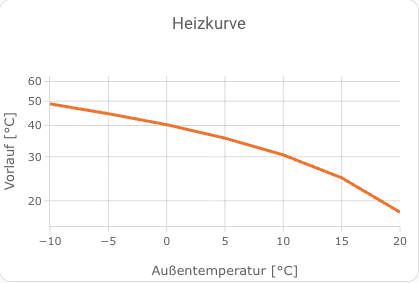

<h2>I am not a developer, so this is just for fun and for anyone who might have use of it. </h2>
<p>Anyone who would like to support, please contact me.</p>

# Heating Curve Simulator

Diese Version ist als Home-Assistant-Custom-Integration aufgebaut und benötigt **keine** Einträge in der `configuration.yaml`.

## Funktionen
- 3 automatisch erzeugte `number`-Entitäten
- 7 automatisch erzeugte `sensor`-Entitäten
- Einrichtung über **Settings → Devices & Services → Add Integration**
- Werte der Number-Entitäten werden wiederhergestellt

## Angelegte Number-Entitäten
- `number.heating_curve_simulator_neigung`
- `number.heating_curve_simulator_niveau`
- `number.heating_curve_simulator_raumtemperatur_soll`

## Angelegte Sensoren
- Soll Vorlauftemperatur bei -10°C Außentemperatur
- Soll Vorlauftemperatur bei -5°C Außentemperatur
- Soll Vorlauftemperatur bei 0°C Außentemperatur
- Soll Vorlauftemperatur bei 5°C Außentemperatur
- Soll Vorlauftemperatur bei 10°C Außentemperatur
- Soll Vorlauftemperatur bei 15°C Außentemperatur
- Soll Vorlauftemperatur bei 20°C Außentemperatur

## Installation
1. Ordner `custom_components/heating_curve_simulator` nach `<config>/custom_components/` kopieren.
2. Home Assistant neu starten.
3. Unter **Einstellungen → Geräte & Dienste → Integration hinzufügen** nach `Heating Curve Simulator` suchen.
4. Integration hinzufügen.

## Formel
```jinja2
{{ RaumtemperaturSoll + niveau - neigung * dar * (1.4347 + 0.021 * dar + 247.9e-6 * dar * dar)) | round(1) }}
```
`dar = aussentemperatur - RaumtemperaturSoll`

## Heizkurve in Homeassistant


## Code für Plotly Graph 
```jinja2
type: custom:plotly-graph
title: Heizkurve
refresh_interval: 120
raw_plotly_config: true
entities:
  - entity: sensor.heizkennlinie_10
  - entity: sensor.heizkennlinie_5_2
  - entity: sensor.heizkennlinie_0
  - entity: sensor.heizkennlinie_5
  - entity: sensor.heizkennlinie_10_2
  - entity: sensor.heizkennlinie_15
  - entity: sensor.heizkennlinie_20_2
layout:
  height: 250
  showlegend: false
  xaxis:
    title:
      text: Außentemperatur [°C]
    range:
      - -10
      - 20
    dtick: 5
  yaxis:
    type: log
    title:
      text: Vorlauf [°C]
    range:
      - 1.2
      - 1.8
  margin:
    l: 50
    r: 20
    t: 40
    b: 60
  shapes:
    - type: path
      path: >-
        $ex `M -10,${parseFloat(hass.states['sensor.heizkennlinie_10'].state)} L
        -5,${parseFloat(hass.states['sensor.heizkennlinie_5_2'].state)} L
        0,${parseFloat(hass.states['sensor.heizkennlinie_0'].state)} L
        5,${parseFloat(hass.states['sensor.heizkennlinie_5'].state)} L
        10,${parseFloat(hass.states['sensor.heizkennlinie_10_2'].state)} L
        15,${parseFloat(hass.states['sensor.heizkennlinie_15'].state)} L
        20,${parseFloat(hass.states['sensor.heizkennlinie_20_2'].state)}`
      line:
        color: "#ff6b00"
        width: 3
data:
  - type: scatter
    mode: markers
    x:
      - -10
      - -5
      - 0
      - 5
      - 10
      - 15
      - 20
    "y":
      - $ex parseFloat(hass.states['sensor.heizkennlinie_10'].state)
      - $ex parseFloat(hass.states['sensor.heizkennlinie_5_2'].state)
      - $ex parseFloat(hass.states['sensor.heizkennlinie_0'].state)
      - $ex parseFloat(hass.states['sensor.heizkennlinie_5'].state)
      - $ex parseFloat(hass.states['sensor.heizkennlinie_10_2'].state)
      - $ex parseFloat(hass.states['sensor.heizkennlinie_15'].state)
      - $ex parseFloat(hass.states['sensor.heizkennlinie_20_2'].state)
    marker:
      size: 1
      color: "#ff6b00"
